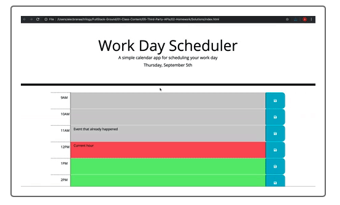

# workday-scheduler
This is a one day scheduling log.  The current day and date will appear at the top of the scheduling log.  As time passes each hour, the time slot will change color (red for past, grey for current and green for future).  For each hour of the day, a task/event can be added to the middle column.  Clicking on the disk icon will save the task/event.  Each hour has it's own disk icon for saving.  The task/event will be stored in local storage when saved.  Reloading or refreshing the website will update the column with the recently saved local storage information.

Established with
-HTML
-CSS
-Javascript
-bootstrap API
-jquery API

Resources:
-Bootstrap
"https://stackpath.bootstrapcdn.com/bootstrap/4.3.1/css/bootstrap.min.css"

-Font
"https://use.fontawesome.com/releases/v5.8.1/css/all.css"
"https://fonts.googleapis.com/css?family=Open+Sans&display=swap"

